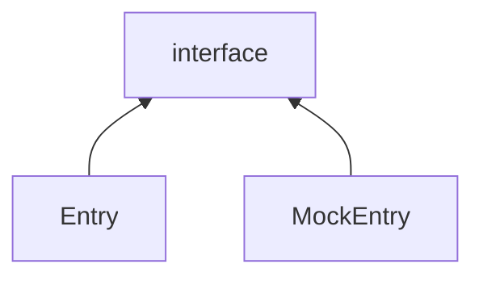
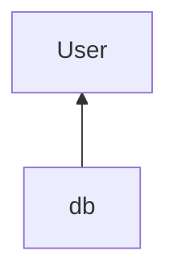
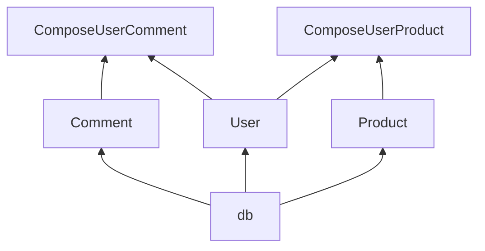

### 为代码编写稳定的单元测试

本文档配套代码仓库地址:

https://github.com/liweiforeveryoung/curd_demo

配合 git checkout 出指定 commit 以及 git diff 比较 commit 间的差别食用更佳

#### 单元测试的作用

1. 功能交付的保障，确保不会发生一些低级错误，只要你觉得哪处逻辑在某种 case 的情况下会有风险，都可以为其编写一个测试用例（不过对于自己压根没有想到的 case，肯定就没法保证了）
2. **<u>功能重构的保障，重构某一段代码时，如何保障重构没有出现问题，就看重构之后的代码能否通过之前的单元测试</u>**
3. 增加研发对功能的信心，每当新写一个功能，为它编写单元测试后，在运行单元测试时，那不停出现的 `pass`能让研发人员更加自信。在交付功能后，不再那么焦虑了，不再担心睡觉时被事故电话吵醒，保持愉悦的心情，头发掉的也不那么快了。
4. 如果项目是使用代码行数来进行绩效考核的，那多编写单元测试还能起到增加 kpi 的作用，一个方法可能就 50 行，为它编写的单元测试代码可能有 100 行。因此单元测试对代码行数的增益效果很高！

#### 对测试的理解

代码里面总是存在调用链的，例如 

```
functionA -> functionB -> functionC -> functionD
```

只要可以确保

```
functionA -> functionB

functionB -> functionC

functionC -> functionD
```

这三个环节不出现问题，那么整条链路就是正确的。

function实质上是对于: <u>对于一个初始状态A，接收一个信号B，变成了另一个状态C</u> 这个过程的抽象

只要 A 和 B 确定了，那 C 也就确定了。

为了写出便于单元测试的代码，需要做到两点:

1. 对代码进行分层，上一层的代码最好只依赖下一层的代码，不要跨级依赖
2. 减少对包级别变量的引用

#### 为依赖外部服务的代码编写单元测试

代码可以分为两个部分，一部分代码没有不依赖外界条件的代码，也不会对外界条件造成影响。最典型的是一些仅仅涉及到计算的或者在构建 struct 的代码。

```go
func Add(i,j int) int{
  return i + j
}
func NewXXX() *XXX{
  return new(XXX)
}
```

另一部分代码则是依赖外界条件的代码，最典型的是一些涉及到 IO 操作的代码，例如往控制台中输出字符串，往网卡读写数据。

```go
func Hello() {
	fmt.Println("hello world")
}
```

这部分代码能否执行成功是不确定的，也许在一条机器上可以执行成功，在另一台没有显卡的机器上就会执行失败。

在为不依赖外界条件的代码写测试时，例如 model 层的代码，一般是比较容易的，先设计好测试用例，然后 go test -v 执行就 ok 了，无论在哪台机器上，测试用例的结果总是一致的。

在为依赖外界条件的代码写测试时，却比较犯难了，最典型的例如业务层的代码，往往涉及到对数据库的 curd，如果连接的数据库不对/数据库里面的表结构不对/数据库中的数据不对，都会导致最终测试的结果不如预期。

如何为依赖外部服务的代码编写单元测试，需要做到这两点:

1. **用代码创造条件**
2. **用代码来检验结果**

##### 为 db 操作写单元测试为例

我原本对业务层代码写单元测试时，采取的是比较笨拙的方式，首先在本机的 mysql 中**<u>手动</u>**建库，建表。

+ 当测试 SearchXXX() 时，就先**<u>手动</u>**在数据库里面插入两条 XXX 记录，之后调用 SearchXXX() ，看能否查询到该数据
+ 当测试 CreateXXX() 时，就调用 CreateXXX() 插入记录，然后在<u>**手动**</u>去 mysql 中寻找，看是否存在刚刚用 CreateXXX() 插入的记录
+ 当测试 UpdateXXX() 是，先<u>**手动**</u>在 mysql 插入一条记录，然后执行 UpdateXXX()，只看在用**<u>肉眼</u>**去 mysql 中查看该条记录是否被更新了

这种测试方法虽然是可以 work 的，但它的缺点也很大

+ 它是**<u>一次性</u>**的，就拿 CreateXXX() 来说把，当你第二次 Create 一条相同的记录时就会发生 duplicate entry 的 error 了。拿 SearchXXX() 来说，如果数据库中的记录发生了变化，那么 SearchXXX() 的结果也肯定不如预期。
+ 过分依赖手动，需要手动去数据库中建表，手动去数据库中准备数据，等测试完之后再手动去数据库中核对结果。每次测试结束后，需要手动的去清理数据库。

这种不稳定的单元测试，显然是没法集成到 CI 中的，毕竟谁也不想，同样的测试用例，第一次可以成功，但是第二次却失败了。如何为这种 crud 逻辑写出稳定的单元测试？我认为需要做到以下几点：

1. 对 db 的测试必须用真实的数据库，不要 mock sql 的执行结果。毕竟 curd 业务的最终结果就是为了在数据库中留下正确的痕迹。
2. 不能依赖之前的遗留的数据，每次执行测试时，自动连接数据库清理历史数据并重新完成建表操作
3. **用代码创造条件**，对于需要数据库中有记录的测试用例，请在执行该测试用例时，用<u>**代码**</u>往数据库中插入数据，例如 UpdateXXX() 的测试用例，肯定需要提前往数据库中插入数据，那就在执行 UpdateXXX() 是，先调用 db.Insert(obj) 插入数据即可
4. **用代码来检验结果**，用代码对用例的执行结果进行校验，而不是用肉眼去数据库中核对记录是否正确
5. 为了方便写单元测试需要合理对代码分层
6. 编写正确的单元测试，采用灵活的方法去核对结果，慎用 Equal 语义。举个例子，在对 SearchXXX() 进行测试时，可能会在调用  SearchXXX() 前在数据库中插入 m 条记录，之后对 SearchXXX() 的执行结果进行校验，假设 SearchXXX() 的执行结果为 records，这时候不要使用 len(records) == m 去校验，因为其他的测试用例里面也可能涉及到数据的插入，records 的数量很可能是大于 m 的，我们能确保的是 records 的数量肯定**<u>不会小于</u>** (GreaterOrEqual) m。且 records 中肯定应该**<u>包含</u>** (Contains) 刚才插入的那 m 条记录。

#### 概述

这篇文章将说明如何利用 Gin 编写一个 mini 版本的 curd 服务器，这套代码的最大优点就是方便进行单元测试。

主要涉及以下内容:

+ 利用 [Gin][gin_repo_addr] 编写一个 http 服务器
+ 利用 [Gorm][gorm_repo_addr] 来进行 sql 操作
+ 利用 [Viper][viper_repo_addr] 来管理配置文件
+ 利用 httptest 对 http 层进行测试
+ 自动 migrate sql 文件到数据库
+ 利用 mock 根据 interface 生成 mock 代码
+ 利用 testify 编写单元测试
+ 利用 testify/suite 来管理单元测试
+ 利用 uber/dig 来管理依赖
+ 利用 cobra 来管理 cli 命令

#### 实践

##### 一个简单的 http 服务器

利用 gin 很容易做到，直接上代码

```go
// main.go
package main

import (
	"net/http"

	"github.com/gin-gonic/gin"
)

func main() {
	engine := gin.Default()
	SetUpRoutes(engine)
	err := engine.Run(":3344")
	if err != nil {
		panic(err)
	}
}

func SetUpRoutes(engine *gin.Engine) {
	engine.GET("/hello", Hello)
}

func Hello(context *gin.Context) {
	context.String(http.StatusOK, "hello world")
}
```

利用 curl 手动测试

```bash
curl --location --request GET ':3344/hello'
```

如愿得到 

```
hello world
```

利用 httptest 库为 Hello route 写一个简单的单元测试，仅仅校验一下 status code 正不正确

```go
// main_test.go
package main

import (
	"net/http"
	"net/http/httptest"
	"testing"

	"github.com/gin-gonic/gin"
)

func TestHello(t *testing.T) {
	g := gin.Default()
	SetUpRoutes(g)

	req := httptest.NewRequest("GET", "/hello", nil)
	w := httptest.NewRecorder()
	g.ServeHTTP(w, req)
	
	resp := w.Result()
	if resp.StatusCode != http.StatusOK {
		t.Errorf("status code is %d,want: %d", resp.StatusCode, http.StatusOK)
	}
}
```

##### 引入 testify 库编写单元测试

在编写单元测试时，每次都需要手动编写

```go
if actualVal != expectVal {
  t.Errorf("want: %v,actual: %v",xxx,xxx)
}
```

这种校验代码，不太方便，使用 testify 这个库可以解决这个问题，testify 库里的 assert 包提供了很多有用的断言函数，例如 `Equal`,`Less`,`Greater`,`LessOrEqual`,`GreaterOrEqual` 等

使用 `assert.Equal` 替换上面的 if 语句

```go
// main_test.go
package main

import (
	"net/http"
	"net/http/httptest"
	"testing"

	"github.com/gin-gonic/gin"
	"github.com/stretchr/testify/assert"	// here!
)

func TestHello(t *testing.T) {
	g := gin.Default()
	SetUpRoutes(g)

	req := httptest.NewRequest("GET", "/hello", nil)
	w := httptest.NewRecorder()
	g.ServeHTTP(w, req)

	resp := w.Result()
	assert.Equal(t, http.StatusOK, resp.StatusCode) // here!
}
```

##### 添加 CRUD 业务逻辑

先在数据库表建好表

```
mysql> CREATE TABLE IF NOT EXISTS `users`
    -> (
    ->     `id`         BIGINT(20)   NOT NULL AUTO_INCREMENT,
    ->     `user_id`    BIGINT(20)   NOT NULL DEFAULT 0 COMMENT '用户 id',
    ->     `name`       VARCHAR(191) NOT NULL DEFAULT '' COMMENT '用户昵称',
    ->     `age`        INT          NOT NULL DEFAULT 0 COMMENT '用户年龄',
    ->     `deleted_at` BIGINT(20)   NOT NULL DEFAULT 0,
    ->     `created_at` BIGINT(20)   NOT NULL DEFAULT 0,
    ->     `updated_at` BIGINT(20)   NOT NULL DEFAULT 0,
    ->     PRIMARY KEY (id),
    ->     UNIQUE INDEX `udx_user_id` (`user_id`)
    -> ) ENGINE = InnoDB
    ->   DEFAULT CHARSET = utf8mb4
    ->   COLLATE = utf8mb4_unicode_ci COMMENT '用户信息表';
Query OK, 0 rows affected (0.04 sec)

mysql> ALTER TABLE `users`
    ->     ADD COLUMN `sex` TINYINT NOT NULL DEFAULT 0 COMMENT '性别';
Query OK, 0 rows affected (0.04 sec)
Records: 0  Duplicates: 0  Warnings: 0
```

写一个 Create 的 handler

```go
func SetUpRoutes(engine *gin.Engine) {
	engine.GET("/hello", Hello)
	engine.POST("/user/create", UserCreate)		// here!!!
}

func UserCreate(ctx *gin.Context) {
	userCreateRequest := new(model.UserCreateRequest)
	err := ctx.BindJSON(userCreateRequest)
	if err != nil {
		ctx.JSON(http.StatusBadRequest, err)
		return
	}
	user := model.NewUser(userCreateRequest)
	err = db.WithContext(ctx).Create(user).Error
	if err != nil {
		ctx.JSON(http.StatusInternalServerError, err)
	}
	ctx.JSON(http.StatusOK, model.NewUserCreateResponse(user))
}
```

###### 手动测试

```bash
curl --location --request POST ':3344/user/create' \
--header 'Content-Type: application/json' \
--data-raw '{
    "user": {
        "name": "levy",
        "age": 18,
        "sex": 1
    }
}'
```

得到

```json
{
    "user": {
        "user_id": 5577006791947779410,
        "name": "levy",
        "age": 18,
        "sex": 1
    }
}
```

再去数据库里面瞅瞅，观察到记录

```
mysql> select * from users;
+----+---------------------+------+-----+------------+------------+------------+-----+
| id | user_id             | name | age | deleted_at | created_at | updated_at | sex |
+----+---------------------+------+-----+------------+------------+------------+-----+
|  1 | 5577006791947779410 | levy |  18 |          0 | 1632641193 | 1632641193 |   1 |
+----+---------------------+------+-----+------------+------------+------------+-----+
1 row in set (0.00 sec)
```

###### 自动测试

结合上面说的要点，也很容易写出测试代码

```go
// main_test.go
func TestUserCreate(t *testing.T) {
	g := gin.Default()
	SetUpRoutes(g)

	user := &model.User{
		Name: "levy",
		Age:  18,
		Sex:  model.MAN,
	}
	userCreateReq := model.NewUserCreateRequest(user)
	contentBytes, _ := json.Marshal(userCreateReq)
	reader := bytes.NewReader(contentBytes)

	req := httptest.NewRequest("POST", "/user/create", reader)
	w := httptest.NewRecorder()
	g.ServeHTTP(w, req)

	// 检查 resp
	resp := w.Result()
	assert.Equal(t, http.StatusOK, resp.StatusCode)
	userCreateResp := new(model.UserCreateResponse)
	err := BindResp(resp, userCreateResp)
	assert.NoError(t, err)
	assert.Equal(t, user.Name, userCreateResp.User.Name)
	assert.Equal(t, user.Age, userCreateResp.User.Age)
	assert.Equal(t, user.Sex, userCreateResp.User.Sex)
	// 检查数据库
	userFromDB := user.DeepCopy()
	err = db.First(userFromDB).Error
	assert.NoError(t, err)
	assert.NotEqual(t, int64(0), userFromDB.UserId)
}
```

但是这个代码肯定通过不了测试，因为 UserCreate() 这个 handler 依赖 db，但是这里却并没有初始化 db。

之前说过，在编写单元测试时，为了防止被之前的脏数据所影响，每次都需要建一个崭新的数据库，并将表结构迁移到数据库里面。后面会有迁移数据表的具体过程。

```go
// main_test.go
func initDB() {
   var err error
   dsn := "root:@tcp(127.0.0.1:3306)/curd_db_test?charset=utf8mb4&parseTime=True&loc=Local"
   db, err = gorm.Open(mysql.Open(dsn), &gorm.Config{})
   if err != nil {
      panic(err)
   }
   // 迁移数据库
   // ...
}
func TestUserCreate(t *testing.T) {
	initDB()
  // ...
}
```

这里比较巧的是 `main_test.go` 和 main.go 都属于 `main` 包，`var db *gorm.DB` 在 main.go 里面被定义，`UserCreate()`引用的是 `main.go` 里面的 `db` 变量。因此在 `main_test.go` 里面直接将 main.go 里面的 `db` 变量给初始化了。**（其实这种做法并不好）**

有了单元测试后，之后每次 push 代码时都需要确保通过所有的单元测试。

##### 迁移数据表到数据库

```go
func initDB() {
	// 当 clientFoundRows 为 true, db.Update().RowsAffected 返回的是匹配到的记录行数
	// 当 clientFoundRows 为 false, db.Update().RowsAffected 返回的是实际更新的记录行数
	dsn := "root:@tcp(127.0.0.1:3306)/curd_db_test?charset=utf8mb4&parseTime=True&loc=Local&clientFoundRows=true"

	dsnCfg, err := gomysql.ParseDSN(dsn)
	if err != nil {
		panic(err)
	}
	dbName := dsnCfg.DBName
	// 在 dsn 中不指定 dbname
	dsnCfg.DBName = ""

	db, err = gorm.Open(mysql.Open(dsnCfg.FormatDSN()), &gorm.Config{})
	if err != nil {
		panic(err)
	}
	// 开启 debug 模式
	db.Logger = db.Logger.LogMode(logger.Info)
	drop := fmt.Sprintf("DROP DATABASE IF EXISTS %s;", dbName)
	create := fmt.Sprintf("CREATE DATABASE %s DEFAULT CHARSET = utf8mb4 COLLATE = utf8mb4_unicode_ci;", dbName)
	use := fmt.Sprintf(`USE %s;`, dbName)
	migrations := LoadMysqlPath("migrations")
	err = db.Exec(drop).Exec(create).Exec(use).Error
	if err != nil {
		panic(err)
	}
	for _, migrate := range migrations {
		err = db.Exec(migrate).Error
		if err != nil {
			panic(err)
		}
	}
}
```

如何做到？只需要将 sql 文件整理到一起，在每次执行单元测试时，将这些 sql 文件全部执行一遍就好了。

建立一个文件夹，名为 `migrations`专门用于存放 sql 文件，每次业务中需要增加新的 sql 表或者修改表的结构时都需要将这些 sql 语句放在 `migrations` 文件夹下面。

```
➜  curd_demo git:(master) ✗ tree
.
├── go.mod
├── go.sum
├── main.go
├── main_test.go
├── migrations
│   ├── v0000_create_users.sql
│   └── v0001_alter_users.sql
```

###### 一个坑

单元测试文件执行时的 root path 和 main.go 所在的 root path 并不一致

```
projectname
	main.go
	config
	pkg_to_be_test
```

在 main.go 中，我们可以采用 `./config`的形式来 load `projectname/config` 文件夹下面的配置文件。

可是在对 `pkg_to_be_test` 包做单元测试时，采用 `./config` load 的将会是  `projectname/pkg_to_be_test/config`而非 `projectname/config`，因此注定会失败。

可以用标准库提供的 `Getwd` 获取当前的 root path

```go
// Getwd returns a rooted path name corresponding to the
// current directory. If the current directory can be
// reached via multiple paths (due to symbolic links),
// Getwd may return any one of them.
func Getwd() (dir string, err error)
```

做个实验

```bash
➜  test_wd tree
.
├── main.go
└── pkg
    └── wd_test.go
➜  test_wd cat main.go
package main

import (
	"fmt"
	"os"
)

func main() {
	fmt.Println(os.Getwd())
}
➜  test_wd cat pkg/wd_test.go
package pkg

import (
	"os"
	"testing"
)

func TestWD(t *testing.T) {
	t.Log(os.Getwd())
}

➜  test_wd go run main.go
/workspace/personal_projects/test_wd <nil> // here!!!
➜  test_wd go test pkg/wd_test.go -v
=== RUN   TestWD
    wd_test.go:9: /workspace/personal_projects/test_wd/pkg <nil> // here!!!
--- PASS: TestWD (0.00s)
PASS
ok  	command-line-arguments	0.148s
```

wd_test.go 执行时的 work path 是 `/workspace/personal_projects/test_wd/pkg`，在路径上包含了 pkg 这个包名。

main.go 执行时的 work path 是   `/workspace/personal_projects/test_wd`

回到主题上来，当测试文件和 main.go 同一级时，load `./migrations`可以正确的将里面的 sql 文件给 load 出来。可当测试文件和 main.go 不是同一级时，load 就会失败。

所以说使用相对路劲是不靠谱的。如何获取 migrations 文件夹的绝对路径？

只要在 curd_demo 项目路径下面，无论在哪个地方调用 Getwd()，得到的绝对路径肯定是 `/aas/bbb/curd_demo/xxx/yyy`的形式，而 migrations 文件夹的绝对路径肯定是 `/aaa/bbb/curd_demo/migrations`。

所以只要先通过 Getwd() 得到当前工作的决定路径，然后通过项目名`curd_demo`截取字符串，即可以得到项目的绝对路径`/aaa/bbb/curd_demo`，之后以 `/aaa/bbb/curd_demo/`为起点，需要名为 `migrations`的文件夹得到它的绝对路径就 ok 了。

##### 利用 viper 管理配置

目前有一些配置是 hardcode 的，例如数据库的 DSN，http 服务的监听端口。现在将这边配置放在配置文件里面。

```
➜  curd_demo git:(master) ✗ tree      
.
├── config
│   ├── config.go
│   ├── db.production.yaml
│   ├── db.test.yaml
│   ├── http.production.yaml
│   └── http.test.yaml
```

为了方便对配置进行管理，根据内容将配置放在了不同的配置文件里面，且对于 dev 环境和 production 环境，将会读取不同的配置文件。

利用 viper 简单封装了一个方法放在 util 包下面，它会将 yaml 格式的配置文件 unmarshal 并 bind 到 struct 上

```go
// BindYamlConfig 负责根据 yaml config file unmarshal 出 struct
// cfgFileName shouldn't contain file type suffix
func BindYamlConfig(cfgBaseDir, cfgFileName string, cfgObjPtr interface{}) error {
	vp := viper.New()
	// jww.SetStdoutThreshold(jww.LevelInfo) 开启 viper 的日志
	vp.AddConfigPath(cfgBaseDir)
	vp.SetConfigName(cfgFileName)
	vp.SetConfigType("yaml")

	err := vp.ReadInConfig()
	if err != nil {
		return fmt.Errorf("ReadInConfig(),err[%w]", err)
	}
	if err = vp.Unmarshal(cfgObjPtr, func(config *mapstructure.DecoderConfig) {
		config.TagName = "yaml"
		// 不能多出不用的配置项
		config.ErrorUnused = true
	}); err != nil {
		return fmt.Errorf("unmarshal(),err[%w]", err)
	}
	return nil
}
```

根据环境读取不同的配置文件

```go
type HttpSetting struct {
	Addr string `yaml:"addr"`
}

func httpConfigInit(env string) *HttpSetting {
	cfg := new(HttpSetting)
	var err error
	switch env {
	default:
		err = util.BindYamlConfig(CfgAbsolutePath, "http.test", cfg)
	case "TEST":
		err = util.BindYamlConfig(CfgAbsolutePath, "http.test", cfg)
	case "PRODUCTION":
		err = util.BindYamlConfig(CfgAbsolutePath, "http.production", cfg)
	}
	if err != nil {
		panic(fmt.Errorf("BindYamlConfig(),err[%w]", err))
	}
	return cfg
}
```

##### 谈谈依赖 (dependency) 

如果 A 的实现需要 B 的参与，则可以称 B 是 A 的依赖。

目前的代码中，`UserCreate` 是依赖 db 的，业务终究是要落地到数据库。此时 `db` 作为 `main` 包的一个对象，来供 `UserCreate` 调用。实际上这是不合理的。

+ 第一个不合理是`db` 作为一个底层依赖（毕竟各个业务方都需要调用），不应该是放在 `main` 这么一个顶层的包里面
+ 第二个不合理是`db`不应该作为一个全局的变量暴露出来

<u>**依赖不应该放在作为 package 级别的变量暴露给全局，而应该被需要使用该依赖的对象各自去持有。**</u>

理由是方便写单元测试，在一个 package 里对另一个 package 内的对象进行读写操作稍不注意就会造成循环引用。

后面将会使用 Entry 来持有依赖，并用 dig 库进行依赖注入

##### api 层

目前 main.go 的负担很重，它需要

+ 初始化 config
+ 初始化 db

+ 注册 route
+ 实现各个 route 下面的 handler
+ 启动 gin 服务

main.go 的工作应该越少越好，仅仅应该完成一些基础配置的初始化。现在将业务相关的一些代码全都转移到 api 层。

```
➜  curd_demo git:(master) ✗ tree 
.
├── apis
│   ├── hello.go
│   ├── hello_test.go
│   ├── http.go
│   ├── user.go
│   └── user_test.go
```

hello.go 里面放的是 `Hello()`

user.go 里面放的是和 user 相关的 handler，目前只有 `UserCreate()`

http.go 里面进行 db 的初始化，http route 的注册以及 gin 服务的启动

```go
// http.go
var db *gorm.DB

func StartHttpService() {
	var err error
	db, err = gorm.Open(mysql.Open(config.Hub.DBSetting.MysqlDSN), &gorm.Config{})
	if err != nil {
		panic(err)
	}

	engine := gin.Default()
	SetUpRoutes(engine)
	err = engine.Run(config.Hub.HttpSetting.Addr)
	if err != nil {
		panic(err)
	}
}
```

现在 main() 里面只有简简单单 3 行代码了

```go
func main() {
	config.Initialize()
	rand.Seed(time.Now().Unix())
	apis.StartHttpService()
}
```

go test 一下，确保通过单元测试

```
go test curd_demo/apis -v
```

```
PASS
ok      curd_demo/apis  0.729s
```

##### interface 和 implement 以及 pkg 层

将接口与实现分离，能够降低耦合，使代码编写单元测试更加容易，一般将 implement 命名为 XXXEntry。

有两个好处

+ 利用 Entry 去持有`依赖`，可以避免`依赖`在全局到处乱飞
+ 根据 interface 可以生成 MockEntry，利用 MockEntry 能够很方便的进行单元测试



目前`UserCreate`的代码如下

```go
func UserCreate(ctx *gin.Context) {
	userCreateRequest := new(model.UserCreateRequest)
	err := ctx.BindJSON(userCreateRequest)
	if err != nil {
		ctx.JSON(http.StatusBadRequest, err)
		return
	}
	user := model.NewUser(userCreateRequest)
	err = db.WithContext(ctx).Create(user).Error
	if err != nil {
		ctx.JSON(http.StatusInternalServerError, err)
	}
	ctx.JSON(http.StatusOK, model.NewUserCreateResponse(user))
}
```

这个 handler 主要完成了三件事情

1. 从 http 的 body 中读取请求，得到 `userCreateRequest`
2. 根据 `userCreateRequest` 的内容进行真正的业务处理处理，操作逻辑，得到 `userCreateResponse`
3. 将 `userCreateResponse`写入 http response

其中 1,3 都是与 http 相关的，而 2 则是与 http 无关的，因为我们仅仅想对数据的操作逻辑进行测试，因此可以将 2 抽离成一个独立的 interface

```go
func UserCreate(ctx *gin.Context) {
	req := new(model.UserCreateRequest)
	err := ctx.BindJSON(req)
	if err != nil {
		ctx.JSON(http.StatusBadRequest, err)
		return
	}
	resp, err := NewUser(db).Create(ctx, req)
	if err != nil {
		ctx.JSON(http.StatusInternalServerError, err)
	}
	ctx.JSON(http.StatusOK, resp)
}

type User interface {
	Create(ctx context.Context, req *model.UserCreateRequest) (*model.UserCreateResponse, error)
}

func NewUser(db *gorm.DB) User {
	return &UserEntry{db: db}
}

type UserEntry struct {
	db *gorm.DB
}

func (entry *UserEntry) Create(ctx context.Context, req *model.UserCreateRequest) (*model.UserCreateResponse, error) {
	user := model.NewUser(req)
	err := entry.db.WithContext(ctx).Create(user).Error
	if err != nil {
		return nil, errors.WithStack(err)
	}
	return model.NewUserCreateResponse(user), nil
}
```

单元测试一下

```
go test curd_demo/apis -v
```

```
PASS
ok      curd_demo/apis  1.126s
```

很自然的，会发现 `User` 这个 interface 并不属于 api 层。于是新建一个 pkg 层，将 User 放进去

```go
// api/user.go
func UserCreate(ctx *gin.Context) {
	req := new(model.UserCreateRequest)
	err := ctx.BindJSON(req)
	if err != nil {
		ctx.JSON(http.StatusBadRequest, err)
		return
	}
	resp, err := pkg.NewUser(db).Create(ctx, req) // 调用 pkg 层的接口
	if err != nil {
		ctx.JSON(http.StatusInternalServerError, err)
	}
	ctx.JSON(http.StatusOK, resp)
}
```

依旧来一个单元测试，理所当然是`pass`

##### 抽离出 dep 层来管理依赖

db 的初始化应该由谁来负责？

目前 db 对象是有 api 层的代码来初始化的，而 api 这么上层的代码是不应该和 db 打交道的，它应该仅仅调用 pkg 层提供的接口，至于 pkg 层的接口是怎么实现的，pkg 层依赖谁，api 层才不需要去关心呢。

db 作为一个被各个上层业务调用的工具人，毫无疑问应该在一个很底层的包里去初始化

新建一个 dep 包吧，用来放置各种底层依赖。

下面 api 层就只需要依赖 dep 层里面的接口，pkg 层负责实现 dep 层中的接口

```go
// dep/hub.go
package dep

import (
   "curd_demo/config"
   "curd_demo/pkg"
   "gorm.io/driver/mysql"
   "gorm.io/gorm"
)

var Hub struct {
   DB   *gorm.DB
   User pkg.User
}

func Prepare() {
   db, err := gorm.Open(mysql.Open(config.Hub.DBSetting.MysqlDSN), &gorm.Config{})
   if err != nil {
      panic(err)
   }
   Hub.DB = db
   Hub.User = pkg.NewUser(db)
}
```

```go
// main.go
package main

import (
	"math/rand"
	"time"

	"curd_demo/api"
	"curd_demo/config"
	"curd_demo/dep"
)

func main() {
	config.Initialize()
	dep.Prepare()			// here!!! 在服务刚开始启动初始化配置后，就把所有依赖都初始化
	rand.Seed(time.Now().Unix())
	api.StartHttpService()
}
```

```go
// api/user.go
func UserCreate(ctx *gin.Context) {
	req := new(model.UserCreateRequest)
	err := ctx.BindJSON(req)
	if err != nil {
		ctx.JSON(http.StatusBadRequest, err)
		return
	}
	resp, err := dep.Hub.User.Create(ctx, req)	// 调用 dep 包里面的 user 接口
	if err != nil {
		ctx.JSON(http.StatusInternalServerError, err)
	}
	ctx.JSON(http.StatusOK, resp)
}
```

```go
func initDB() {
	config.Initialize()
	dsnCfg, err := gomysql.ParseDSN(config.Hub.DBSetting.MysqlDSN)
	if err != nil {
		panic(err)
	}
	dbName := dsnCfg.DBName
	// 在 dsn 中不指定 dbname
	dsnCfg.DBName = ""

	db, err := gorm.Open(mysql.Open(dsnCfg.FormatDSN()), &gorm.Config{})
	if err != nil {
		panic(err)
	}
	// 开启 debug 模式 方便看到每次执行时的 sql 语句
	db.Logger = db.Logger.LogMode(logger.Info)
	drop := fmt.Sprintf("DROP DATABASE IF EXISTS %s;", dbName)
	create := fmt.Sprintf("CREATE DATABASE %s DEFAULT CHARSET = utf8mb4 COLLATE = utf8mb4_unicode_ci;", dbName)
	use := fmt.Sprintf(`USE %s;`, dbName)
	migrations := FolderContentLoad(config.MigrationsFolderName)
	err = db.Exec(drop).Exec(create).Exec(use).Error
	if err != nil {
		panic(err)
	}
	for _, migrate := range migrations {
		err = db.Exec(migrate).Error
		if err != nil {
			panic(err)
		}
	}
	dep.Hub.DB = db			// here!!! 初始化 Hub 包里面的依赖
	dep.Hub.User = pkg.NewUser(db) // here!!!
}
```

##### 每层的单元测试也应该各司其职

先看看 api/user_test.go 里面的测试代码

```go
func TestUserCreate(t *testing.T) {
	initDB()

	g := gin.Default()
	SetUpRoutes(g)

	user := &model.User{
		Name: "levy",
		Age:  18,
		Sex:  model.MAN,
	}
	userCreateReq := model.NewUserCreateRequest(user)
	contentBytes, _ := json.Marshal(userCreateReq)
	reader := bytes.NewReader(contentBytes)

	req := httptest.NewRequest("POST", "/user/create", reader)
	w := httptest.NewRecorder()
	g.ServeHTTP(w, req)

	// 检查 resp
	resp := w.Result()
	assert.Equal(t, http.StatusOK, resp.StatusCode)
	userCreateResp := new(model.UserCreateResponse)
	err := BindResp(resp, userCreateResp)
	assert.NoError(t, err)
	assert.Equal(t, user.Name, userCreateResp.User.Name)
	assert.Equal(t, user.Age, userCreateResp.User.Age)
	assert.Equal(t, user.Sex, userCreateResp.User.Sex)
	// 检查数据库
	userFromDB := user.DeepCopy()
	err = dep.Hub.DB.First(userFromDB, user).Error
	assert.NoError(t, err)
	assert.NotEqual(t, int64(0), userFromDB.UserId)
}
```

这段测试代码模拟了一个 http 请求的处理过程，它会检查 http reponse 的 body 以及数据库里面的数据

但是 api 层只应该处理 http 相关的东西，我们把具体业务逻辑实现应该交由了 pkg 层去处理

同理，api 层的单元测试也只应该处理 http 相关的东西，业务逻辑的单元测试应该放到 pkg 层的单元测试里面

在  pkg 层下面新建 user_test.go , 在里面进行业务逻辑的测试

```go
// pkg/user_test.go
package pkg

import (
	"context"
	"fmt"
	"testing"

	"curd_demo/config"
	"curd_demo/model"
	"curd_demo/util"
	gomysql "github.com/go-sql-driver/mysql"
	"github.com/stretchr/testify/assert"
	"gorm.io/driver/mysql"
	"gorm.io/gorm"
	"gorm.io/gorm/logger"
)

func initDB() *gorm.DB {
	config.Initialize()
	dsnCfg, err := gomysql.ParseDSN(config.Hub.DBSetting.MysqlDSN)
	if err != nil {
		panic(err)
	}
	dbName := dsnCfg.DBName
	// 在 dsn 中不指定 dbname
	dsnCfg.DBName = ""

	db, err := gorm.Open(mysql.Open(dsnCfg.FormatDSN()), &gorm.Config{})
	if err != nil {
		panic(err)
	}
	// 开启 debug 模式 方便看到每次执行时的 sql 语句
	db.Logger = db.Logger.LogMode(logger.Info)
	drop := fmt.Sprintf("DROP DATABASE IF EXISTS %s;", dbName)
	create := fmt.Sprintf("CREATE DATABASE %s DEFAULT CHARSET = utf8mb4 COLLATE = utf8mb4_unicode_ci;", dbName)
	use := fmt.Sprintf(`USE %s;`, dbName)
	migrations := util.FolderContentLoad(config.ProjectName, config.MigrationsFolderName)
	err = db.Exec(drop).Exec(create).Exec(use).Error
	if err != nil {
		panic(err)
	}
	for _, migrate := range migrations {
		err = db.Exec(migrate).Error
		if err != nil {
			panic(err)
		}
	}
	return db
}

func TestUserEntry_Create(t *testing.T) {
	db := initDB()
	entry := UserEntry{db: db}
	user := &model.User{
		Name: "levy",
		Age:  18,
		Sex:  model.MAN,
	}
	userCreateReq := model.NewUserCreateRequest(user)
	userCreateResp, err := entry.Create(context.TODO(), userCreateReq)
	assert.NoError(t, err)
	assert.Equal(t, user.Name, userCreateResp.User.Name)
	assert.Equal(t, user.Age, userCreateResp.User.Age)
	assert.Equal(t, user.Sex, userCreateResp.User.Sex)
	// 检查数据库
	userFromDB := user.DeepCopy()
	err = db.First(userFromDB, user).Error
	assert.NoError(t, err)
	assert.NotEqual(t, int64(0), userFromDB.UserId)
}
```

##### 利用 mock 来进行测试

再看看 UserCreate 方法

```go
// api/user.go
func UserCreate(ctx *gin.Context) {
	req := new(model.UserCreateRequest)
	err := ctx.BindJSON(req)
	if err != nil {
		ctx.JSON(http.StatusBadRequest, err)
		return
	}
	resp, err := dep.Hub.User.Create(ctx, req)	// 不想进入 UserEntry 里面
	if err != nil {
		ctx.JSON(http.StatusInternalServerError, err)
	}
	ctx.JSON(http.StatusOK, resp)
}
```

如何做到在不接触 UserEntry 的情况下，只对 http 层进行测试？

答：用 mock

利用 mockgen 工具可以根据接口来生成 mock entry 的代码

```go
//go:generate mockgen -destination user_mock.go -package pkg -source user.go User
type User interface {
	Create(ctx context.Context, req *model.UserCreateRequest) (*model.UserCreateResponse, error)
}
```

```go
// api/user_test.go
func TestUserCreate(t *testing.T) {
	g := gin.Default()
	SetUpRoutes(g)

	user := &model.User{
		Name: "levy",
		Age:  18,
		Sex:  model.MAN,
	}
	userCreateReq := model.NewUserCreateRequest(user)
	contentBytes, _ := json.Marshal(userCreateReq)
	reader := bytes.NewReader(contentBytes)

	req := httptest.NewRequest("POST", "/user/create", reader)
	w := httptest.NewRecorder()

  // here !!!!!!!!!!!!!!
	ctrl := gomock.NewController(t)
	defer ctrl.Finish()
	userMock := pkg.NewMockUser(ctrl)
  // 注意
	dep.Hub.User = userMock
	// 可以用 gomock.Any() 代表任何类型的参数
	userMock.EXPECT().Create(gomock.Any(), userCreateReq).Return(new(model.UserCreateResponse), nil)
  // end !!!!!!!!!!!!!!!

	g.ServeHTTP(w, req)

	// 只简单检查一下 StatusCode
	assert.Equal(t, http.StatusOK, w.Code)
}

```

```go
userMock.EXPECT().Create(gomock.Any(), userCreateReq).Return(new(model.UserCreateResponse), nil)
```

这句代码声明了：在参数为 gomock.Any() 和 userCreateReq 时，调用 userMock.Create() 方法，得到的返回值将会是 new(model.UserCreateResponse) 和 nil。

**mock 的一个更实用的例子: 对 rpc 接口进行 mock**

##### 单元测试的生命周期 && 利用 suite 包管理测试

单元测试大概有这五个阶段

1. BeforeAllTests 在开始执行**第一条**测试用例之前的阶段
2. BeforeTest 在执行**每一条**测试用例之前的阶段
3. InTest 正在执行**某一条**测试用例
4. AfterTest 在执行**每一条**测试用例之后的阶段
5. AfterAllTests 在**所有**测试用例执行完成之后的阶段

```
BeforeAllTests ---> BeforeTest ---> InTestA ---> AfterTest
							 ---> BeforeTest ---> InTestB ---> AfterTest ---> AfterAllTests
```

可以看到，步骤 1,5 是对称的，2,4 也是对称的

在 1,2,4,5 这几个阶段，是可以进行一次资源初始化和清理工作的

例如在阶段 1，可以初始化所有的测试用例都需要用到的资源，例如在 pkg 包里，所有测试用例都需要用到的资源肯定就是 db 啦，毕竟 pkg 包所进行的就是一些 db 的逻辑操作。

在阶段 5，可以进行一些资源的清理操作，或者统计测试时间等

在阶段2,4，可以进行一些单个测试需要的操作，例如之前在 api 层的 mock 测试有这么两句代码

```go
ctrl := gomock.NewController(t)
defer ctrl.Finish()
```

实际在在每个单元测试用例里面都是需要先创建一个崭新的 ctrl (避免被之前的测试用例影响到) ，并在该条测试用例执行结束后把 ctrl 给 Finish() 掉

testify 的 suite 包里面实现了对单元测试声明周期的各个阶段进行管理，只需要实现对应的接口即可

```go
// SetupAllSuite has a SetupSuite method, which will run before the
// tests in the suite are run.
// 对应 BeforeAllTests 阶段
type SetupAllSuite interface {
	SetupSuite()
}

// SetupTestSuite has a SetupTest method, which will run before each
// test in the suite.
// 对应 BeforeTest 阶段
type SetupTestSuite interface {
	SetupTest()
}

// TearDownAllSuite has a TearDownSuite method, which will run after
// all the tests in the suite have been run.
// // 对应 AfterAllTests 阶段
type TearDownAllSuite interface {
	TearDownSuite()
}

// TearDownTestSuite has a TearDownTest method, which will run after
// each test in the suite.
// 对应 AfterTest 阶段
type TearDownTestSuite interface {
	TearDownTest()
}

// BeforeTest has a function to be executed right before the test
// starts and receives the suite and test names as input
type BeforeTest interface {
	BeforeTest(suiteName, testName string)
}

// AfterTest has a function to be executed right after the test
// finishes and receives the suite and test names as input
type AfterTest interface {
	AfterTest(suiteName, testName string)
}

// WithStats implements HandleStats, a function that will be executed
// when a test suite is finished. The stats contain information about
// the execution of that suite and its tests.
type WithStats interface {
	HandleStats(suiteName string, stats *SuiteInformation)
}
```

在 api 包下面建一个 suite_test.go 在里面完成 suite 对象的创建操作

```go
// api/user_test.go
type SuiteTest struct {
	suite.Suite

	userMock *pkg.MockUser
	ctrl     *gomock.Controller
}

// In order for 'go test' to run this suite, we need to create
// a normal test function and pass our suite to suite.Run
func TestSuiteTest(t *testing.T) {
	suite.Run(t, new(SuiteTest))
}

// SetupAllSuite has a SetupSuite method, which will run before the
// tests in the suite are run.
func (s *SuiteTest) SetupSuite() {
	config.Initialize()
}

// SetupTestSuite has a SetupTest method, which will run before each
// test in the suite.
func (s *SuiteTest) SetupTest() {
	s.ctrl = gomock.NewController(s.T())
	s.userMock = pkg.NewMockUser(s.ctrl)
	dep.Hub.User = s.userMock
}

// TearDownTestSuite has a TearDownTest method, which will run after
// each test in the suite.
func (s *SuiteTest) TearDownTest() {
	s.ctrl.Finish()
}
```

```go
// pkg/user_test.go
func (s *SuiteTest) TestUserCreate() {
	g := gin.Default()
	SetUpRoutes(g)

	user := &model.User{
		Name: "levy",
		Age:  18,
		Sex:  model.MAN,
	
	userCreateReq := model.NewUserCreateRequest(user)
	contentBytes, _ := json.Marshal(userCreateReq)
	reader := bytes.NewReader(contentBytes)

	req := httptest.NewRequest("POST", "/user/create", reader)
	w := httptest.NewRecorder()
	// 可以用 gomock.Any() 代表任何类型的参数
	s.userMock.EXPECT().Create(gomock.Any(), userCreateReq).Return(new(model.UserCreateResponse), nil)		// here!!!!

	g.ServeHTTP(w, req)
	// 只简单检查一下 StatusCode
	s.Equal(http.StatusOK, w.Code)
}
```

同理 pkg 层也做一下改造

```go
// pkg/user_test.go
type SuiteTest struct {
	suite.Suite
	db        *gorm.DB
	UserEntry *UserEntry
}

// In order for 'go test' to run this suite, we need to create
// a normal test function and pass our suite to suite.Run
func TestSuiteTest(t *testing.T) {
	suite.Run(t, new(SuiteTest))
}

// SetupAllSuite has a SetupSuite method, which will run before the
// tests in the suite are run.
func (s *SuiteTest) SetupSuite() {
	config.Initialize()
	dsnCfg, err := gomysql.ParseDSN(config.Hub.DBSetting.MysqlDSN)
	if err != nil {
		panic(err)
	}
	dbName := dsnCfg.DBName
	// 在 dsn 中不指定 dbname
	dsnCfg.DBName = ""

	db, err := gorm.Open(mysql.Open(dsnCfg.FormatDSN()), &gorm.Config{})
	if err != nil {
		panic(err)
	}
	// 开启 debug 模式 方便看到每次执行时的 sql 语句
	db.Logger = db.Logger.LogMode(logger.Info)
	drop := fmt.Sprintf("DROP DATABASE IF EXISTS %s;", dbName)
	create := fmt.Sprintf("CREATE DATABASE %s DEFAULT CHARSET = utf8mb4 COLLATE = utf8mb4_unicode_ci;", dbName)
	use := fmt.Sprintf(`USE %s;`, dbName)
	migrations := util.FolderContentLoad(config.ProjectName, config.MigrationsFolderName)
	err = db.Exec(drop).Exec(create).Exec(use).Error
	if err != nil {
		panic(err)
	}
	for _, migrate := range migrations {
		err = db.Exec(migrate).Error
		if err != nil {
			panic(err)
		}
	}
	s.db = db
	s.UserEntry = &UserEntry{db: db}
}
```

```go
// user_test.go
func (s *SuiteTest) TestUserEntry_Create() {
	user := &model.User{
		Name: "levy",
		Age:  18,
		Sex:  model.MAN,
	}
	userCreateReq := model.NewUserCreateRequest(user)
	userCreateResp, err := s.UserEntry.Create(context.TODO(), userCreateReq) // // here!!! 使用 SuiteTest 里面的 userEntry 成员
	s.NoError(err)						// here!!! 断言方法可以全都用 suite 的方法替代
  s.Equal(user.Name, userCreateResp.User.Name)
	s.Equal(user.Age, userCreateResp.User.Age)
	s.Equal(user.Sex, userCreateResp.User.Sex)
	// 检查数据库
	userFromDB := user.DeepCopy()
	err = s.db.First(userFromDB, user).Error	// here!!! 使用 SuiteTest 里面的 db 成员
	s.NoError(err)
	s.NotEqual(int64(0), userFromDB.UserId)
}
```

单元测试一下

```shell
➜  curd_demo git:(master) ✗ go test ./...      
?       curd_demo       [no test files]
ok      curd_demo/api   3.036s
?       curd_demo/config        [no test files]
?       curd_demo/dep   [no test files]
?       curd_demo/model [no test files]
ok      curd_demo/pkg   3.159s
ok      curd_demo/util  0.186s
```

接口的好处：可能当前这个接口的实现是在自己服务内部进行数据查询，但是如果以后想拆分成微服务，也是非常容易的，新创建一个实现，在这个实现内部调用 grpc 就行，都上层代码没有一丝一毫的影响。

##### 利用 dig 库管理依赖

> 此时项目还不是太复杂，进行依赖管理似乎显得有点多余

目前项目中的业务层接口还只有一个: User 接口，它依赖于一个 db 对象




随着业务的复杂度增加，以后肯定会有很多新的接口，

例如 Product (商品) 和  Comment (评论) 接口，他们也依赖 db 对象。

可能还会出现接口的组合，比如某个 UserProductCompose 接口，他可能依赖 user 和 product



此时 dep 包里面的景象可能是这样的

```go
var Hub struct {
	DB                 *gorm.DB
	User               pkg.User
	Comment            pkg.Comment
	Product            pkg.Product
	ComposeUserProduct pkg.ComposeUserProduct
	ComposeUserComment pkg.ComposeUserComment
}

func Prepare() {
	db, err := gorm.Open(mysql.Open(config.Hub.DBSetting.MysqlDSN), &gorm.Config{})
	if err != nil {
		panic(err)
	}
	Hub.DB = db
	Hub.User = pkg.NewUser(db)				// here!!!
	Hub.Comment = pkg.NewComment(db)  // here!!!
	Hub.Product = pkg.NewProduct(db)	// here!!!
	Hub.ComposeUserProduct = pkg.NewComposeUserProduct(Hub.User, Hub.Product) 	// here!!!
	Hub.ComposeUserComment = pkg.NewComposeUserComment(Hub.User, Hub.Comment)		// here!!!
}
```

```go
// pkg/xxx.go
type Comment interface{}
type Product interface{}
type ComposeUserProduct interface{}
type ComposeUserComment interface{}

type CommentEntry struct {
	db *gorm.DB
}
type ProductEntry struct {
	db *gorm.DB
}
type ComposeUserProductEntry struct {
	user    User
	product Product
}
type ComposeUserCommentEntry struct {
	user    User
	comment Comment
}

func NewComment(db *gorm.DB) Comment {
	return &CommentEntry{db: db}
}
func NewProduct(db *gorm.DB) Product {
	return &ProductEntry{db: db}
}
func NewComposeUserProduct(user User, product Product) ComposeUserProduct {
	return &ComposeUserProductEntry{
		user:    user,
		product: product,
	}
}
func NewComposeUserComment(user User, comment Comment) ComposeUserComment {
	return &ComposeUserCommentEntry{
		user:    user,
		comment: comment,
	}
}
```

每增加一个新的 interfaceImplement ，都需要在 `Prepare()` 里面调用 `NewXXX(dep1,dep2...depn) `实例出一个对象出来。其中 `dep1,dep2...depn` 指的是该 implement 所需要的依赖。

用上面的 `NewComposeUserProduct()` 来举例，它依赖 `User` 和 `Product`这两个接口，而为了得到这两个接口，你就必须调用 NewUser() 和 NewProduct() 传入 db 对象来生成这两个接口。对于高层的接口，它的依赖链可能会很长。当依赖链过长且依赖链间彼此交织，如果需要自己去初始化依赖链条上面的每一个节点，可能会有点繁琐。

dig 库提供了一种自动生成依赖的能力，只要用户给出对象的生成方法( constructor) ，它就能就能初始化出相应的对象。

这里有一个 DI 库使用方法的简单介绍:  https://www.cnblogs.com/XiaoXiaoShuai-/p/15316584.html

应用了 DI 库之后，代码就变成这样了

```go
// dep/hub.go
var Hub hub

type hub struct {
	dig.In
	DB   *gorm.DB
	User pkg.User
}

var diContainer = dig.New()

func NewGormDB() (*gorm.DB, error) {
	return gorm.Open(mysql.Open(config.Hub.DBSetting.MysqlDSN), &gorm.Config{})
}

func Prepare() {
	_ = diContainer.Provide(NewGormDB)
	_ = diContainer.Provide(pkg.NewUser)

	err := diContainer.Invoke(func(h hub) {
		Hub = h
	})
	if err != nil {
		panic(err)
	}
}
```

##### 将 table migrate 到生产环境

随着业务的扩大，肯定会需要新增表结构或者修改原来的表结构。我原来的做法是先这个 sql 语句保存下来，每当需要发布新的版本时，先用 jumpserver 连接到 production 的机器，然后在上面连接到 production 的数据库。之后再将这些 sql 文件全都执行进去。每次在 production 环境手动输入 sql 语句都让人有点心惊胆战，生怕某个字符输错了。那是否可以自动的迁移 sql 文件到 production 的数据库中？

在之前的单元测试中，会自动 migrate sql 文件到测试用的数据库里面。做法是先 drop 掉原来的数据库并重新建一个新的，之后再将数据库全都迁移到新的数据库里面，因此数据库每次都是新的，所以不会存在某个 sql 文件被重复 migrate 的情况。在 production 环境中，肯定是不能做 drop database 这种操作的。为了防止 sql 文件被重复 migrate，可以在数据库里面新建一张表，这张表里面会记录已经 migrate 的 sql 文件名。

```sql
CREATE TABLE IF NOT EXISTS migrations
(
    id         BIGINT(20)   NOT NULL AUTO_INCREMENT,
    file_name  VARCHAR(191) NOT NULL DEFAULT '' COMMENT '已经迁移的文件名',
    deleted_at BIGINT(20)   NOT NULL DEFAULT 0,
    created_at BIGINT(20)   NOT NULL DEFAULT 0,
    updated_at BIGINT(20)   NOT NULL DEFAULT 0,
    PRIMARY KEY (id),
    UNIQUE INDEX udx_file_name (file_name)
) ENGINE = InnoDB
  DEFAULT CHARSET = utf8mb4
  COLLATE = utf8mb4_unicode_ci COMMENT '迁移信息表';
```

每次迁移时，会将 migrations 文件夹下面的 sql 文件全都 load 出来，将 migrations 表里面的数据也 load 出来，得到还没有被迁移的 sql 文件，将这些文件全都迁移到数据库里面，并在 migrations 表里面添加这些文件的记录。

```go
type DBEntry struct {
	dig.In
	*gorm.DB
}

func (entry *DBEntry) Migrate(ctx context.Context) error {
	entry.DB = entry.Debug()
	err := entry.WithContext(ctx).Exec(new(model.Migration).SQL()).Error
	if err != nil {
		return errors.WithStack(err)
	}
	migrations := make([]*model.Migration, 0, 0)
	err = entry.WithContext(ctx).Find(&migrations).Error
	if err != nil {
		return errors.WithStack(err)
	}
	folder, err := util.LoadFolderUnderProject(config.ProjectName, config.MigrationsFolderName)
	if err != nil {
		return errors.WithStack(err)
	}
	filesNotMigrated := model.MigrationSlice(migrations).FilesNotMigrated(folder)
	for _, file := range filesNotMigrated {
		// 执行迁移文件
		if err = entry.WithContext(ctx).Exec(string(file.Content)).Error; err != nil {
			return errors.Errorf("exec err,file[%v],err[%v]", file, err)
		}
		// 插入 migrations 表中一条记录
		m := &model.Migration{FileName: file.Name}
		if err = entry.WithContext(ctx).Create(m).Error; err != nil {
			return errors.Errorf("create err,migration[%v],err[%v]", m, err)
		}
	}
	return nil
}
```

##### 利用 cobra 来管理 cli 命令

> Cobra is both a library for creating powerful modern CLI applications as well as a program to generate applications and command files.

可以把上面迁库工具集成到我们的项目里面，用一个命令去执行它。我们的项目叫做 curd_demo ，它目前有两个功能

1. 启动 http 服务
2. migrate sql 文件

结合 cobra 库，可以用两个单独的子命令来分别启动这两个功能

```
➜  curd_demo git:(master) ✗ ./curd_demo -h
a curd demo to learn how to write testable code

Usage:
  curd_demo [command]

Available Commands:
  completion  generate the autocompletion script for the specified shell
  help        Help about any command
  http        启动 http 服务
  migrate     迁移 sql 文件到数据库

Flags:
  -h, --help   help for curd_demo

Use "curd_demo [command] --help" for more information about a command.
```

启动 http 服务

```
➜  curd_demo git:(master) ✗ ./curd_demo http
INFO[0000] start http service...                        
[GIN-debug] [WARNING] Creating an Engine instance with the Logger and Recovery middleware already attached.

[GIN-debug] [WARNING] Running in "debug" mode. Switch to "release" mode in production.
 - using env:   export GIN_MODE=release
 - using code:  gin.SetMode(gin.ReleaseMode)

[GIN-debug] GET    /hello                    --> curd_demo/api.Hello (3 handlers)
[GIN-debug] POST   /user/create              --> curd_demo/api.UserCreate (3 handlers)
[GIN-debug] Listening and serving HTTP on :3344
```

执行 migrate 命令

```
➜  curd_demo git:(master) ✗ ./curd_demo migrate    
INFO[0000] start migrate ...  
...
```

这样每次发布新版本时，只需要执行 curd_demo migrate 命令就可以将 sql 表迁移过去了。

代码的变化

新建一个 cmd 包，下面有三个文件

```go
// cmd/root.go
package cmd

import (
	"math/rand"
	"time"

	"curd_demo/config"
	"curd_demo/dep"
	"github.com/spf13/cobra"
)

// rootCmd represents the base command when called without any subcommands
var rootCmd = &cobra.Command{
	Use:   "curd_demo",
	Short: "a curd demo to learn how to write testable code",
}

// Execute adds all child commands to the root command and sets flags appropriately.
// This is called by main.main(). It only needs to happen once to the rootCmd.
func Execute() {
	cobra.OnInitialize(initialize)
	rootCmd.AddCommand(&migrateCommand)
	rootCmd.AddCommand(&httpCommand)
	cobra.CheckErr(rootCmd.Execute())
}

func initialize() {
	config.Initialize()
	dep.Prepare()
	rand.Seed(time.Now().Unix())
}
```

```go
// cmd/http.go
package cmd

import (
	"curd_demo/api"
	"github.com/spf13/cobra"
)

var httpCommand = cobra.Command{
	Use:   "http",
	Short: "启动 http 服务",
	RunE: func(cmd *cobra.Command, args []string) error {
		return api.StartHttpService()
	},
}
```

```go
// cmd/migrate.go
package cmd

import (
	"context"
	"time"

	"curd_demo/dep"
	"github.com/pkg/errors"
	"github.com/sirupsen/logrus"
	"github.com/spf13/cobra"
)

var migrateCommand = cobra.Command{
	Use:   "migrate",
	Short: "迁移 sql 文件到数据库",
	RunE: func(cmd *cobra.Command, args []string) error {
		logrus.Info("start migrate ...")
		ctx, cancel := context.WithTimeout(context.Background(), time.Minute*2)
		defer cancel()
		err := dep.Hub.DB.Migrate(ctx)
		if err != nil {
			return errors.WithStack(err)
		}
		logrus.Info("end migrate")
		return nil
	},
}
```

在 main.go 里面调用 Execute() 即可

```go
// main
package main

import "curd_demo/cmd"

func main() {
	cmd.Execute()
}
```

##### gitlab ci

终于讲到 CI 了，单元测试是 CI 里面比不可少的一部分。目前我们项目使用的是 gitlab 自带的 CI 工具。使用起来还是蛮方便的。

首先需要把项目打包成一个 image，config 文件夹里面防止了项目启动所必须要的配置文件，migrations 文件夹里面放置了 sql 文件，这两货是项目启动所必不可少的。所以需要把这两个文件夹里面的文件全都放到 image 里面，

其次，由于我们的 pkg 包里面的单元测试都是直接操作的数据库，因此 CI 里面肯定也需要一个 mysql 服务来陪伴。gitlab ci 的 runner 里面就提供了这样的功能，和 docker-compose 一样，同样使用了 services 这个关键字。

下面就是 test 阶段所用到的 gitlab-ci.yml，

```yml
# .gitlab-ci.yml
test:
  stage: test
  image: golang:1.16
  services:
    - name: mysql:5.7
#      entrypoint: [ "docker-entrypoint.sh" ]
#      command: [ "mysqld" ]
  before_script:
    - echo 'wait for mysql, sleep 5s zzz'
    - sleep 5
  script:
    - make test
  variables:
    MYSQL_ALLOW_EMPTY_PASSWORD: "yes" # 这个环境变量会传递到 mysql 镜像
  tags:
    - docker # 这个 tag 是公司的 gitlab runner 要求的, 如果没有 tag 的话, 公司的 runner 就不会执行这个 CI job
```

简单说一下 gitlab-ci.yml ，更详细的资料可以去官网了解或者去网上找资料

gitlab-ci.yml 由一个个 job 构成，上面只有一个 job，job 名为 test，该 job 所属的 stage 也同样名为 test。

stage 可以有三个值: build,test,deploy, 每个阶段可以有多个 job

```yml
test1:
	stage: test
test2:
	stage: test
```

如上，在 test 这个 stage 上有 test1 和 test2 这两个 job

将会按照 build,test,deploy 的顺序来执行 stage 上面的 job

image 指定这个 job 会在那个 image 上面执行，如果没有 image，将会在一个 linux shell 环境下面执行。因为这里的单元测试需要用到 go sdk，所以用到了 go 的镜像。

services 指定这个  job 需要用到哪些镜像，services 里面指定的镜像将会和 image 中指定的镜像关联在一起

> Similar to `image` property, but will link the specified services to the `image` container.

script 指定了该 job 执行的指令

before-script 将会在执行 script 之前执行

variables 中指定的变量将会传递到该 job 里面容器的环境变量里面。

job 都是放在 gitlab runner 上去跑的，tags 则用来指定 runner

> Use `tags` to select a specific runner from the list of all runners that are available for the project

执行的效果是这样的

```
$ echo 'wait for mysql, sleep 5s zzz'
wait for mysql, sleep 5s zzz
$ sleep 5
$ make test
go test ./...
?   	curd_demo	[no test files]
ok  	curd_demo/api	0.018s
?   	curd_demo/cmd	[no test files]
?   	curd_demo/config	[no test files]
?   	curd_demo/dep	[no test files]
ok  	curd_demo/model	0.005s
ok  	curd_demo/pkg	0.076s
ok  	curd_demo/util	0.011s
Job succeeded
```

##### 单元测试的 tip

tip1: 单元测试所用到的数据尽量不要 hard code, 多用随机函数去生成

tip2: 利用工具函数来生成单元测试所需要的 model

```go
func fakeUser(opts ...func(*User)) *User {
	m := &User{
		UserId: rand.Int63(),
		Age:    int32(rand.Intn(100)),
	}
	for _, opt := range opts {
		opt(m)
	}
	return m
}
```

#### 题外话: 单仓和多仓

我原本是多仓的忠实拥趸，按照功能的不同，建立不同的微服务，每个微服务一个 repo，不同的 repo 有着各自的一亩三分地，不干涉不属于自己的业务，不同的微服务通过 grpc 相互调用。

**但是微服务就一定得是一个单独的 repo 么？不能把这些微服务全都放在同一个 repo 下面么？**

例如之前我将 GameServer 和 GMServer 放在了不同的 repo 里面，优点就是各自的功能比较明确，GMServer 就是用来负责一些后台的 CURD ，不会干涉 GameServer 核心的业务逻辑（当然肯定可以通过影响 mysql 从而影响到 gameserver）。

缺点是，两个 repo 有很多重复的代码，例如数据库里某些表的 model struct 以及对这些 struct 的增删改查代码就是相同的，因为两个 repo 都是对相同的表在进行增删改查。

一开始的做法是将这些 model 层的代码 copy 一份放在另一个 repo 里面，但是之后当 GameServer 里面 model 层的代码发生变动时可能并不会同步到 GMServer 那边，两边的 model 层代码差异慢慢会变大，最终会变成各自维护一份代码，虽然这两份代码的内容可能很多都是一样的。

之后又想着将这些公用的 model 都放进一个独立的包里单独发布，然后让两个 repo 都 import 这个公用的包，一旦 model 层发生了变化，两边只要都 go get 到最新的代码就行了。可这样也有问题，因为 model 层的代码是可能进场发生变化的，比如说，为了代码的可读性，需要一些逻辑封装成一个个 method，每当有这样的变动时，都需要去那个公共的 model 包里面更新代码，打 tag，之后再 go get 更新 model 包的版本，get 到新的 model 代码后，在继续写逻辑。所以特别繁琐，效率很低。

所以就干脆把 GameServer 和 GMServer 放在一个 repo 下面呗，他们的 model 和 curd 接口都是相同的，只要写一份，两边的上层逻辑都能调用，他们都属于这个大的 repo 下面的不同的 component，使用不同的 cmd 命令启动即可。

这样在迁移/修复数据库数据时非常方便，因为有 model 包以及各种 db 接口依赖的支持。上层的业务代码（迁移数据也算是业务代码）调用时会特别方便。

所以，我渐渐变成单仓的拥趸了。

我认为可以把项目的代码都放在一个仓库里，不同的服务用一个不同的 cmd 启动即可（利用 cobra 包）。

据说 Google 全公司的项目都在一个很大的 repo 里面，我感觉这不是挺合适的。。

#### 题外话: compose 层

接口之间的层级关系应该是清晰的，不要出现接口 A 调用接口 B，接口 B 又反过来调用接口 A 的情况，如果有这种情况，那就抽离出一个接口 C，让接口 C 来调用接口 A 和 接口 B，或者让接口 A 和 接口 B 去调用接口 C

如果采用让接口 C 来调用接口 A 和 接口 B的方式，则 C 接口依赖 A 和 B 这两个接口，那就可以新建一个 compose 层，把 C 接口放在 compose 层里面，这样当对 C 接口进行单元测试时，可以 mock A 和 B 接口的结果。

#### 相关链接

https://github.com/bouk/monkey

https://geektutu.com/post/quick-go-test.html

https://geektutu.com/post/quick-gomock.html

[gin_repo_addr]: https://github.com/gin-gonic/gin
[gorm_repo_addr]: https://github.com/go-gorm/gorm
[viper_repo_addr]: https://github.com/spf13/viper
[testify_repo_addr]: https://github.com/stretchr/testify
[mock_repo_addr]: https://github.com/golang/mock
[dig_repo_addr]: https://github.com/uber-go/dig
[cobra_repo_addr]: https://github.com/spf13/cobra
